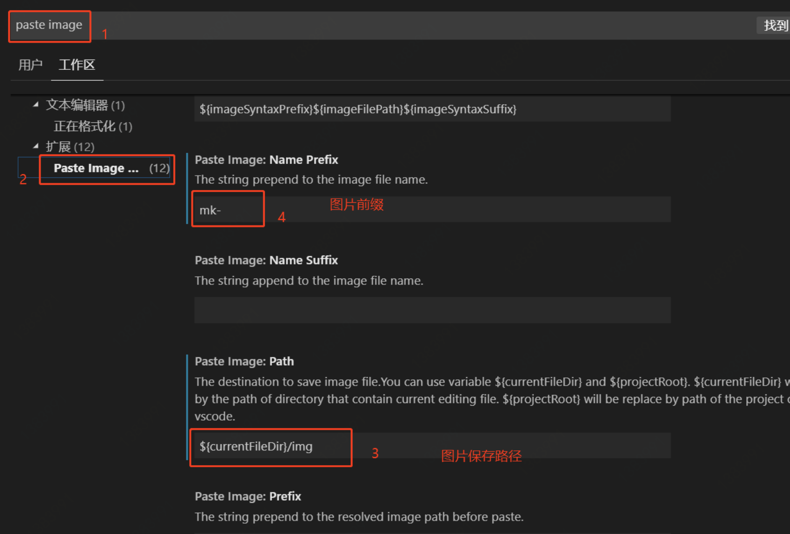

# markdown的基本操作

---

## 基本的文本操作

### 一级标题
## 二级标题
# 三级标题

正常的文本输入

进行**加粗**的操作

这是*斜体* 的文字

看下 ***加粗和斜体***

这是~标注~

来`高亮`

## 其他的操作

### 代码块

```java
public void class MARKDOWN(){
    return null;
}
```
> 引用

1. 有序列表
2. 有序列表
   1. 小标题


* 无序列表
* 无需
  * 下一集集


| 小红 | 小白 | 小金 |
| ---- | ---- | ---- |
| 2    | 3    | 5    |


插入图片

pasteimage修改图片的[保存基本路径](https://blog.csdn.net/javahighness/article/details/90454136)



其他功能就边看边学吧